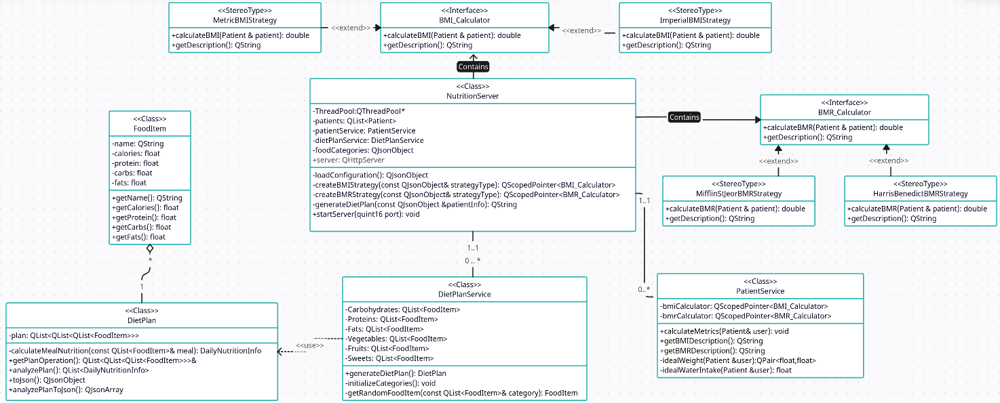

# QtBackendApp

QtBackendApp is a backend application built using the Qt framework, designed to handle server-side processing and data management. This application serves as the backbone of a larger system, managing client requests, processing data, and ensuring smooth communication between various components.

## Project Overview

QtBackendApp leverages the power and versatility of the Qt framework to provide a robust and efficient backend solution. It is designed with scalability and maintainability in mind, making it suitable for a wide range of applications, from small projects to large-scale systems.

## Features

- **High Performance:** Efficiently handles multiple client requests with low latency.
- **Cross-Platform:** Runs on Windows, Linux, and macOS.
- **Modular Design:** Easily extendable to add new features and functionalities.
- **Integration:** Seamlessly integrates with front-end applications and other systems.

## Software Requirements

- **Qt Framework** (version 6.x or higher)
- **C++ Compiler** (compatible with Qt, e.g., GCC, MSVC)
- **CMake** (for building the project)

## Architecture

